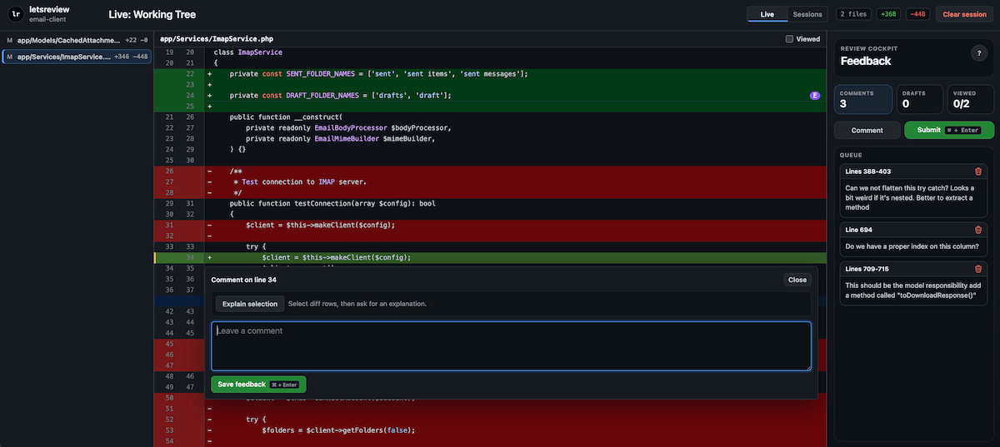

# letsreview

AI agents write hundreds of lines per commit. `letsreview` gives you a fast, local web UI to review all of it and send feedback straight back to your agent — no pull requests, no manual change referencing. Vim-style keyboard controls (`j`/`k` to navigate, `Shift+j`/`Shift+k` to extend selection) so you never have to reach for the mouse.



**The problem:** Your agent just rewrote half the codebase. You could make a branch, open a pull request, and review it there. But that flow was built for humans collaborating asynchronously, not for reviewing your own agent's work in real time.

**The fix:** Start a review session from your terminal (or let your agent start it). Review the diff in your browser. Leave line comments. Hit submit. Your agent gets the feedback and keeps going.

## Install

```sh
go install github.com/mohammed-io/letsreview/cmd/letsreview@v0.0.1
```

Or build from source:

```sh
git clone https://github.com/mohammed-io/letsreview.git
cd letsreview
make build
```

The binary goes into `$GOPATH/bin` (usually `$HOME/go/bin`). Add it to your `PATH` if needed.

## Quick start

```sh
letsreview /path/to/repo
```

Opens a browser showing your working tree diff. Click lines, write comments, submit. Your agent picks up the feedback through MCP.

You can also let the agent kick things off — it calls `request_code_review`, your browser opens, and it waits for your review.

## How it works

```
  Your agent                letsreview               You
  (Claude/Codex/     stdio JSON-RPC         HTTP + browser
   OpenCode)          (MCP tools)
      │                    │                      │
      │ request_code_review│                      │
      │───────────────────►│ opens browser        │
      │                    │─────────────────────►│
      │                    │                      │ review code,
      │                    │                      │ write comments
      │                    │  submit review       │
      │                    │◄─────────────────────│
      │ get_pending_events │                      │
      │───────────────────►│                      │
      │ review_submitted   │                      │
      │◄───────────────────│                      │
      │                    │                      │
      │ get_review_result  │                      │
      │───────────────────►│                      │
      │ { comments, ... }  │                      │
      │◄───────────────────│                      │
```

You can submit multiple reviews per session. Each one creates a new event the agent receives. No one-shot lockout.

## CLI

```sh
letsreview [flags] [repo]
```

```
-addr string   listen address (default "127.0.0.1:55492")
-open          print URL only, don't open browser
```

`repo` defaults to `.` (current directory).

### Multiple repos in one server

The first `letsreview` process starts the server. If you run another one with the same address, it registers its repo with the existing server instead of starting a second one. All repos share one UI.

### Keyboard shortcuts

| Key | Action |
|-----|--------|
| `j` / `k` | Move selection |
| `Shift+j` / `Shift+k` | Extend selection (multi-line) |
| `Space` | Open inline review |
| `n` / `p` | Next / previous file |
| `v` | Toggle file viewed |
| `Cmd+Enter` | Save feedback or submit review |

## MCP tools

Run the MCP server:

```sh
letsreview --mcp
```

| Tool | What it does |
|------|-------------|
| `request_code_review` | Creates session, opens browser, returns `sessionId` + `lastEventSeq` |
| `get_pending_events` | Non-blocking poll for new events since last `seq` |
| `get_review_result` | Returns latest submitted review with all comments |
| `submit_explanation` | Responds to an explanation request from the reviewer |
| `cancel_review` | Cancels a review session |

Events you can receive from `get_pending_events`:

- `explanation_requested` — reviewer selected code and wants an explanation
- `explanation_submitted` — agent sent an explanation back
- `review_submitted` — reviewer submitted comments

Full details in [HANDBOOK.md](./HANDBOOK.md).

## MCP client setup

First, make sure `letsreview` is on your `PATH`.

### Claude Code

Project-level `.mcp.json` or global `~/.claude/mcp.json`:

```json
{
  "mcpServers": {
    "letsreview": {
      "command": "letsreview",
      "args": ["--mcp"]
    }
  }
}
```

### Codex (OpenAI)

`~/.codex/mcp.json`:

```json
{
  "mcpServers": {
    "letsreview": {
      "command": "letsreview",
      "args": ["--mcp"]
    }
  }
}
```

### OpenCode

Project-level `opencode.json`:

```json
{
  "mcp": {
    "letsreview": {
      "command": "letsreview",
      "args": ["--mcp"]
    }
  }
}
```

Everything runs locally over stdio. No API keys, no cloud.

## Development

```sh
make build    # build binary
make test     # run tests
make vet      # run go vet
make clean    # remove binary
```
